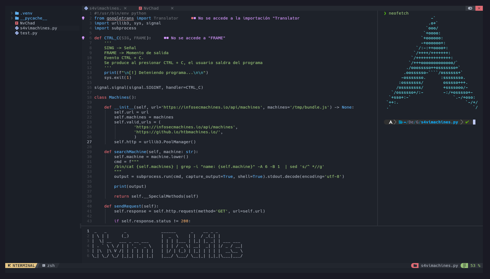

# NvChad Dotfiles.




Original Repository from [NvChad](https://github.com/NvChad/starter) 
Thanks to [saboru](https://github.com/kokaito-git) for give me his configs from [NvChad](https://github.com/NvChad/starter)

---

Install al requirements: 

```bash
# Debian

sudo apt update && sudo apt upgrade -y
sudo apt install npm nodejs -y

# Arch
sudo pacman -Syu
sudo pacman -S nodejs npm
```

---

### Put the config in neovim

```bash
git clone https://github.com/FlickGMD/NvimDotfiles ~/.config/nvim
```

---

### In neovim

```vim
:MasonInstallAll
```

> [!IMPORTANT]
> You should install [neovim](https://github.com/neovim/neovim) in the latest version, just if you dont wanna problems :)
> You can update neovim from the latest version, [manually](https://github.com/neovim/neovim/releases/tag/v0.10.4) 

- Or you can update neovim using an script

```bash
curl -s -X GET https://raw.githubusercontent.com/FlickGMD/AutoBSPWM/refs/heads/main/nvim_upload.sh | bash
```

Mensajes de ayuda

https://github.com/user-attachments/assets/72d25de0-8d6d-499d-a65f-7f1c84437988


